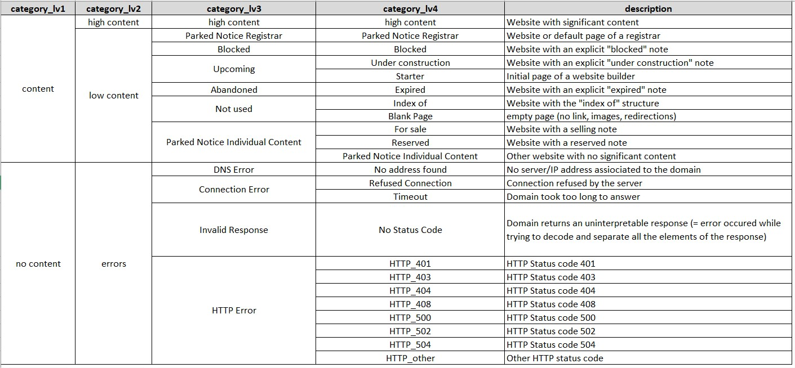

# Sign-of-life Crawler

This repository contains the source code of the sign-of-life domain crawler.


#### File architecture ####

    sign_of_life_crawler
    ├── .docker
    │   └── data            # Folder for input data of docker instances 
    ├── app_domains		# Source code of the crawler in particular:
    │   ├── config.py       # General parameters of the crawler, including the input folder to scan "input_folder"
    │   └── main_domains.py # Main script of the crawler
    ├── input		# Input list of URLS + various necessary input files (Registrar lists, Trained ML models etc...)
    │   └── folder_X        # The CSV files with the input lists of domains must be added to a folder in input   
    ├── inter               # Folder containing intermediary results
    ├── output              # Folder containing output files with the crawler classification, 1 file/input file
    ├── docs                # Documentation of the crawler
    ├── env_required        # Specific library to install
    └── logging        	# Logging folder if the option is activated in config.py


Setting Up the environment
--------------------------

#### Hardware ####

System requirements:
- number of files opened/stored in one folder: 10k files (CONTROLLER_LIMIT parameter in config.py)
- memory at gathering of website pages: ~~ 8GB RAM (average) for 10k (CONTROLLER_LIMIT parameter in config.py)
- number of processes in parallel:  must be less than number of CPUs of your machine  (MAX_PROCESSES and WORKERS_POST_PROCESSING in config.py)
- No/deactivated antivirus (that may remove intermediary files that contain HTML pages)

#### Softwares ####

You can manually install all dependencies with Anaconda or use contenerised system using Docker.

### Docker ###

Set the .env ( `cp .docker/.env.example .docker/.env` ) to configure the database connection.
There is service inside for psql database, but code accepts remote connections

After this build docker normally (`cd .docker && docker compose build`)

Running docker system allows you to deploy crawler in number of instances (replicas).
By default docker compose deploys 2 replicas which needs at least 16GB of RAM.
To controll number of replicas use `--scale crawler=<number_of_instances>`

In summary to run crawler by docker:
```bash
docker compose up --scale crawler=<number_of_instances>
```
Every container scans `data/*.csv` files for a URLs (it's a shared directory with the `.docker/data` from the host).


### Anaconda (Python) ###

Download the lastest anaconda  at https://www.anaconda.com/products/individual  
Install it, tick the box to add conda to the PATH.

At the end of this step, the command "conda" must be recognized by the command line

##### PostGre SQL #####

In Windows:

* Download and install PostGreSQL at https://www.postgresql.org/download/

In Linux, run:

* `sudo apt-get install -y libpq-dev`

##### Chrome #####

In Windows:

* If not already installed, download and install Chrome at https://www.google.com/chrome/

In Linux:
* for a system-wide chrome, run the following commands:

`wget https://dl.google.com/linux/direct/google-chrome-stable_current_amd64.deb`

`sudo apt install ./google-chrome-stable_current_amd64.deb`

##### ChromeDriver #####

Get chromedriver link at https://chromedriver.chromium.org/downloads    
Make sure the version matches your version of Chrome (available by typing in Chrome address bar: chrome://settings/help)

In Windows:

* Download and unzip the driver in given location. Then add that location to the PATH variable.

In Linux :

  * for example with the version 83:
 
    * `wget https://chromedriver.storage.googleapis.com/83.0.4103.39/chromedriver_linux64.zip`

    * `unzip chromedriver_linux64.zip`

    * `cp ./chromedriver /usr/bin/chromedriver`

##### Visual C++ Build Tools #####

In windows:

* Download and install Visual studio build tools at https://visualstudio.microsoft.com/thank-you-downloading-visual-studio/?sku=BuildTools&rel=16   
When installing, make the box "C++ build tools" is ticked 

In Linux:

* `sudo apt install build-essential`

#### Libraries ####

To install the required libraries, run the following commands:

`conda create -n centr python=3.7`

`conda activate centr`  

`python -m pip install -U pip`  

`pip install -r requirements_before_torch.txt`

`pip install torch==1.3.1+cpu -f https://download.pytorch.org/whl/torch_stable.html`  

`pip install -r requirements_after_torch.txt`

To compromise on some conflicts of versions:   
`pip install -r requirements_final.txt`

For  word forms library:

navigate to "sign_of_life/env_required/word_forms-master"
  
`conda activate centr` (if not already activated)

`python setup.py install`

Usage
--------------------------

#### Categories ####

The domains are classified into the following categories:



#### Use ####

1) Put the list of domains to scan in 1 or multiple CSV files. Each file must have a column named "url".    
Move these files into a unique folder (named "folder_X" for this example) in sign_of_life_crawler\input

2) In config.py, update the parameter "input_folder" = join(MAIN_DIR, "input", "folder_X")

3) run the main script:     
 `python main_domains.py`

At the end of the run, the output file is in saved in output, with the same name as the input file to which the prefix "final_" is added

Set the connection to the database in .env fill ( `cp .env.example .env` ).
