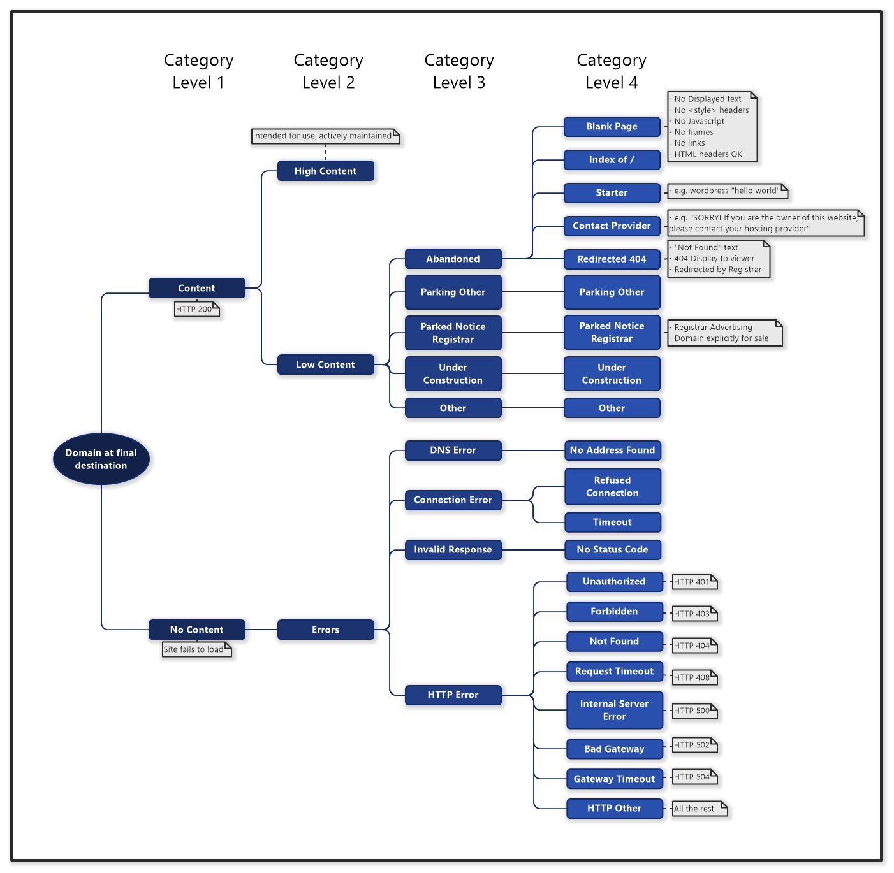
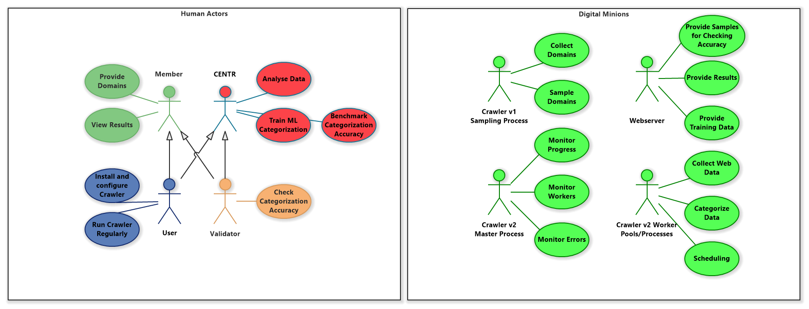
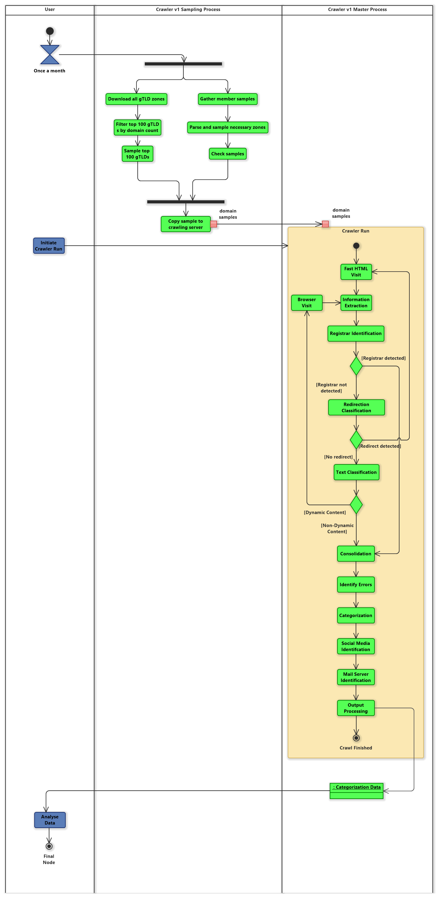
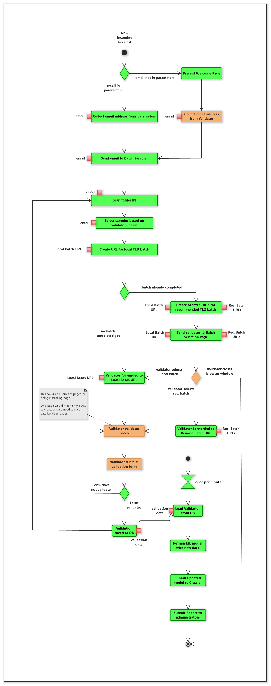
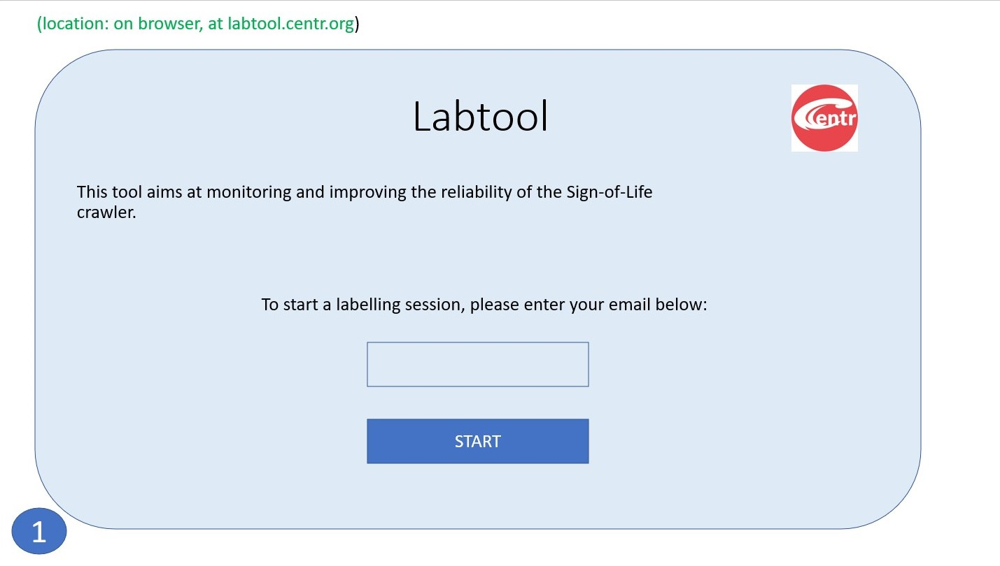
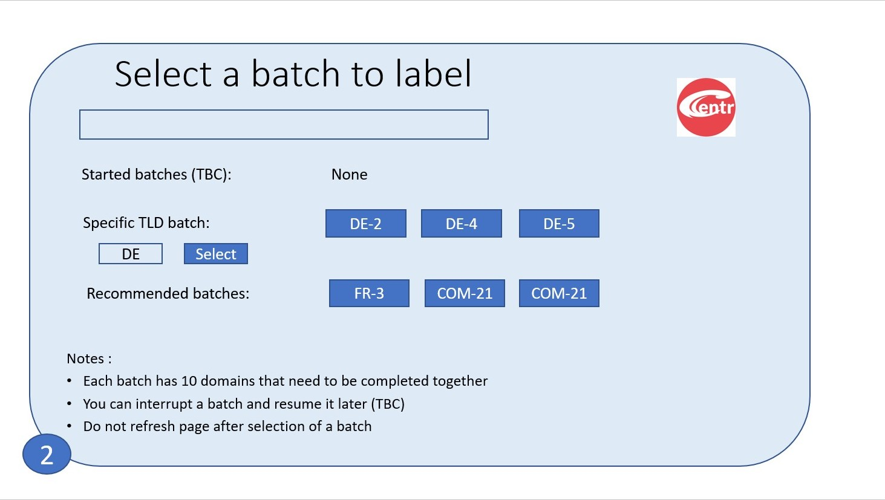
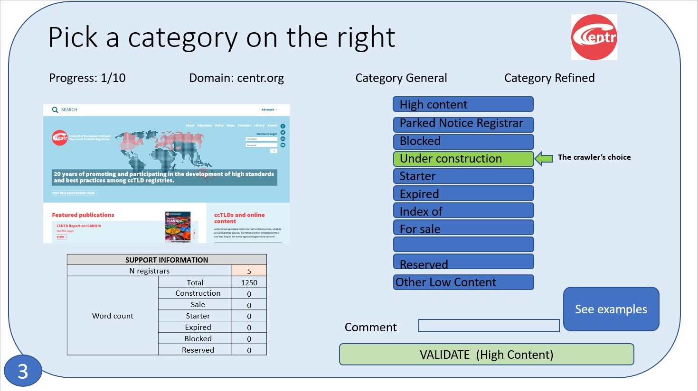

# CENTR Crawler V2 June 2021 Dev Update

## Targets
So far most of our time has been spent getting ourselves organised, and looking into the various options on how we can scale the crawler, as well as make it more reliable. The targets that we've set ourselves for Crawler V2 (with current progress in brackets), are that:

- It produces data consistently (~80%)
- It runs with minimal ongoing intervention (i.e. highly automated with good monitoring aspects) (v1:~90%, v2:~20%)
- Members have a way to review and contribute to the code if they wish (~95%)
- All code added to the master branch is done through a merge-request, after peer-review (~80%)
- It is well documented, with good source code commenting coverage (~30%)
- It follows the Data Lake principle, so we can get accurate and fair snapshots of each TLD for comparison (~10%)
- It is capable of intuitive scaling, from 1 to many servers using basic configuration settings (~10%)
- Is capable of processing (retrieving + processing) 50k domains per hour, given enough infrastructure (~10%)

As you can see, we've got our work cut out for us, so we've also been spending a bit of time doing some experimentation and research on what tools we could use to help us. The biggest issue we're going to face is being able to scale domain requests per hour while still being confident that the retrieved pages are faithful to a home-user visit. Luckily, Kubernetes + Docker seem to be a good fit to solve this problem, and we'll be able to keep much of the existing codebase, modified to use containers. Docker will also solve a lot of environment / install issues members have been having while getting the current crawler to run themselves.

## Crawler V1 vs V2 Architecture 
We have a Work-In-Progress software Architecture, which we're happy to receive your feedback on (see below for pics). The main thought-process behind it is that to increase resiliency, scale and overall efficiency, each domain should be processed individually as opposed to moved along in batches (as per V1). One of the major issues we faced in V1 was that domains were processed in large batches, and when one failed, it caused the whole pipeline to crash. It was partly due to the way python's async function worked, so a simple fix couldn't be found and we were stuck with a clumsy workaround by using smaller batches. While it allowed us to still collect data, many times we came close to  running out of month before running out of domains to crawl! Not a fun experience, nor really fair on those who were being run last.

The alternative architecture we've come up with will hopefully allow for scaling and better resource utilization. To create it we identified and separated out which tasks were suited to be run concurrently. A master will keep a tab on things, and worker-pools with different skillsets will be given chunks of domains to handle. Each worker-pool will manage its own specific resources, such as local bandwith or memory constraints. 

Given this master/worker-pool system, something like Kubernetes should then be able to balance those worker-pools according to resource load, and we should be able to increase the crawler's efficiency that way. We still need to test the feasibility of this, so my upcoming task is to get the existing crawler working in a Docker container and loading onto a Kubernetes node. Once that is working, I will start breaking bits of it up to use multiple containers and see what we can learn about its load balancing features. Hopefully I'll have some results to report on that for the next Dev Update.

## LabTool
Another WIP item we have are some details for the LabTool component (also below). LabTool will hopefully allow non-technical staff to contribute to the project by helping us train the ML models. It will run a light webserver, which will present visitors a small series of screenshots taken during crawling. The sites will be from the same TLDs as the visitor (based on email address), and the page will show what the crawler categorized the website as. The user will be able to select a different category they think is more suitable, or simply agree and validate the crawler's choice. Once they have finished the small initial batch (~10-20), they will be thanked and given a choice to do another batch if they wish, which could be of either their own tld as before, or others we might need extra help with. We will periodically take this data and use it to improve the models for the respective TLDs.

## Pics
### Crawler Architecture WIP
#### Categories

#### Use Cases

#### V1 Overview

#### V2 Overview

### LabTool WIP
#### Activity

#### File Architecture

#### GUI Welcome/Email not provided

#### GUI Select Batch

#### GUI Validate Category

